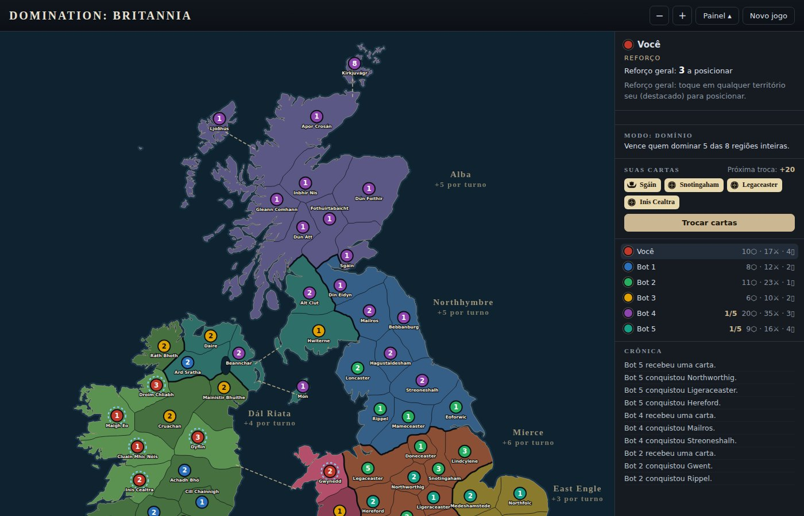
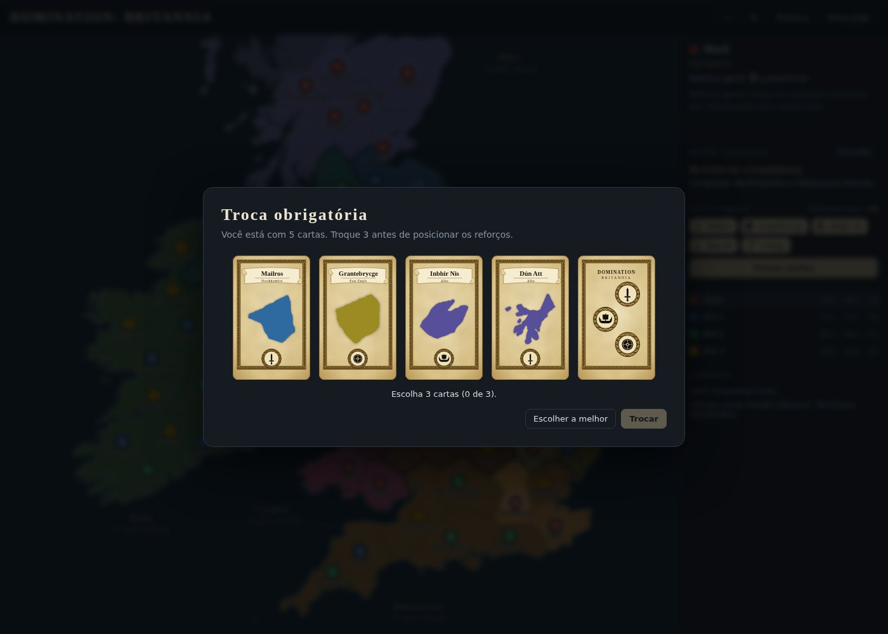
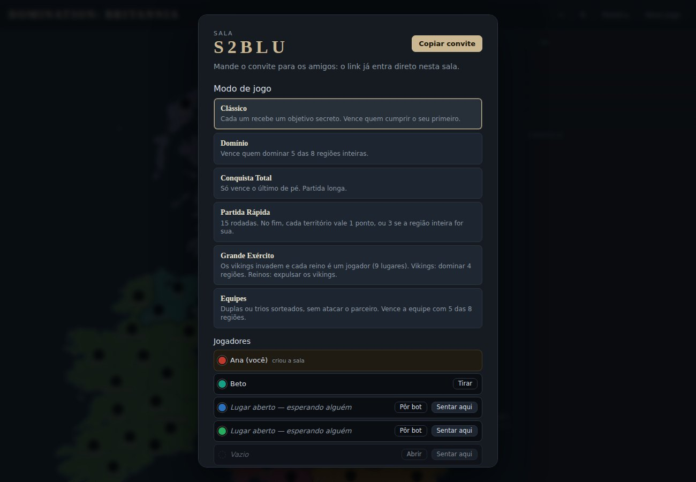
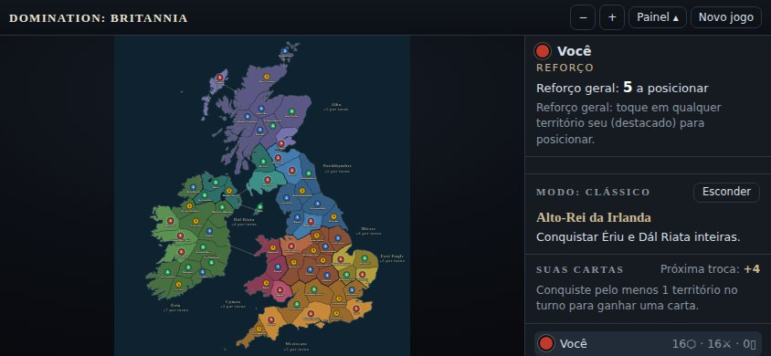

# Domination: Britannia

**🎮 Jogar / Play:** [kfgc-web.github.io/dmnbv1](https://kfgc-web.github.io/dmnbv1/)

🇧🇷 **[Português](#português)** • 🇬🇧 **[English](#english)**

---

## Português

Jogo de estratégia por turnos no navegador, estilo **War**, ambientado na **Britânia e Irlanda por volta de 866 d.C.**, a era dos anglo-saxões, celtas e vikings de *The Last Kingdom*. São 64 territórios e 8 regiões, todos com **nomes de época** (Eoforwic, Lundenburg, Dyflin, Kirkjuvágr…).

**Direção criativa: Kauã Felipe Gielow Camargo.**
Código escrito com o auxílio do Claude (Anthropic), sob a direção criativa de Kauã.

### Como jogar

Cada turno tem três fases:

1. **Reforço:** você recebe exércitos (um terço dos seus territórios, no mínimo 3, mais o bônus de cada região inteira que for sua) e posiciona região por região.
2. **Ataque:** combate com **dados de 8 lados**. O ataque rola até 4 dados e a defesa até 3; comparam-se os maiores, e o **empate é da defesa**. Ao conquistar, você escolhe se entram 1, 2 ou 3 exércitos.
3. **Remanejamento:** mova tropas entre territórios seus vizinhos (cada exército só se move uma vez por turno).

Conquistou pelo menos um território no turno? Ganha uma **carta**. Três símbolos iguais ou três diferentes viram exércitos: 4, 6, 8, 10, 12, 15, 18, 20 e depois +5 a cada troca da mesa.

### Modos de jogo

- **Tutorial:** novo no jogo? Comece aqui. Uma partida guiada contra 3 bots mais fracos: balões explicam cada passo e você vence ao fechar 3 regiões inteiras, à sua escolha.
- **Clássico:** cada um recebe um objetivo secreto (32 possíveis, dos mais fáceis aos dificílimos). Vence quem cumprir o seu primeiro.
- **Domínio:** vence quem dominar 5 das 8 regiões inteiras.
- **Conquista Total:** só vence o último de pé.
- **Partida Rápida:** 15 rodadas; no fim, cada território vale 1 ponto, ou 3 se a região inteira for sua.
- **Grande Exército:** os vikings invadem e cada reino é um jogador (9 lugares). Os vikings vencem se dominarem 4 regiões. Os reinos precisam expulsá-los, mas **só um reino vence**: o que tiver mais **pontos**, e cada exército viking derrotado vale 1 ponto. Os reinos também podem se atacar. Por isso, quem está longe dos vikings (na Irlanda, por exemplo) precisa decidir se ataca ou não os seus "aliados": se atacar, compra briga com eles (até os bots revidam); se não atacar, dificilmente fará pontos e quase não terá chance de vencer.
- **Equipes:** duplas ou trios, sem atacar o parceiro. Vence a equipe com 5 das 8 regiões.

### Jogar online com amigos

Crie uma sala e mande o **convite** (o link já entra direto na sala) ou passe o **código de 5 letras**. Quem criou a sala escolhe o modo e os lugares (pessoa, bot ou vazio); cada pessoa escolhe a sua cor. Cada um joga no seu aparelho.

- Se alguém **cair**, o bot joga a vez dele depois de 10 segundos. Quando a pessoa volta, é só abrir o jogo de novo.
- Se alguém ficar **parado** mais de 1 minuto, quem criou a sala pode pôr o bot para jogar aquela vez.
- Os dados saem de um sorteio que todos os aparelhos conferem: ninguém consegue inventar resultado.
- No fim, **Jogar de novo** leva todo mundo de volta para a sala, com os mesmos lugares e cores: é só começar a revanche.

### No celular

Dá para **instalar como app** (pelo navegador: "Instalar" ou "Adicionar à tela inicial"). O jogo **sozinho contra bots funciona sem internet**. No celular, joga-se **deitado**.

### Por dentro

HTML, CSS e JavaScript puro, sem framework e sem etapa de build. As regras ficam em `motor.js`, os bots em `bots.js` e a tela em `telas.js`. O online usa o **Firebase Realtime Database** (baixado só quando você escolhe jogar online). O mapa foi desenhado a partir do litoral real (Natural Earth, domínio público).

### Direitos autorais

© 2026 Kauã Felipe Gielow Camargo. Todos os direitos reservados.
O código, o mapa, os textos, os nomes e a identidade visual não podem ser copiados, modificados, distribuídos ou explorados sem autorização prévia e escrita do titular. Veja o [LICENSE](LICENSE).

---

## English

A turn-based strategy game for the browser, in the style of **Risk**, set in **Britain and Ireland around 866 AD**, the age of Anglo-Saxons, Celts and Vikings seen in *The Last Kingdom*. It has 64 territories across 8 regions, all with **period names** (Eoforwic, Lundenburg, Dyflin, Kirkjuvágr…).

**Creative direction: Kauã Felipe Gielow Camargo.**
Code written with the help of Claude (Anthropic), under Kauã's creative direction.

### How to play

Each turn has three phases:

1. **Reinforce:** you get armies (a third of your territories, at least 3, plus a bonus for every whole region you hold) and place them region by region.
2. **Attack:** combat uses **eight-sided dice**. The attacker rolls up to 4 dice and the defender up to 3; the highest dice are compared, and **ties go to the defender**. When you conquer a territory, you choose whether 1, 2 or 3 armies move in.
3. **Fortify:** move troops between your own neighbouring territories (each army moves only once per turn).

Conquered at least one territory this turn? You draw a **card**. Three matching or three different symbols trade for armies: 4, 6, 8, 10, 12, 15, 18, 20, then +5 per trade at the table.

### Game modes

- **Tutorial:** new to the game? Start here. A guided match against 3 weaker bots: speech bubbles explain each step, and you win by holding any 3 regions entirely.
- **Classic:** everyone gets a secret objective (32 in total, from easy to brutal). The first to complete theirs wins.
- **Domination:** hold 5 of the 8 regions entirely.
- **Total Conquest:** last one standing wins.
- **Quick Match:** 15 rounds; at the end each territory is worth 1 point, or 3 if you hold its whole region.
- **Great Army:** the Vikings invade and every kingdom is a player (9 seats). The Vikings win by holding 4 regions. The kingdoms must drive them out, but **only one kingdom wins**: the one with the most **points**, and every Viking army defeated is worth 1 point. Kingdoms may also attack each other. So a kingdom far from the Vikings (Ireland, for example) has to decide whether to turn on its "allies": attack them and you make enemies (even bots strike back); hold back and you will hardly score, leaving you almost no chance to win.
- **Teams:** pairs or trios who can't attack each other. The team holding 5 of the 8 regions wins.

### Play online with friends

Create a room and send the **invite link** (it opens straight into the room) or share the **5-letter code**. The host picks the mode and the seats (person, bot or empty); each person picks their colour. Everyone plays on their own device.

- If someone **drops out**, a bot plays their turn after 10 seconds. To get back in, they just open the game again.
- If someone is **idle** for more than a minute, the host can let a bot play that turn.
- Dice come from a shared draw that every device checks, so nobody can fake a roll.
- When the game ends, **Play again** brings everyone back to the room with the same seats and colours, ready for a rematch.

### On your phone

The game **installs as an app** (from the browser: "Install" or "Add to Home Screen"). **Single-player against bots works offline.** On phones it is played in **landscape**.

### Under the hood

Plain HTML, CSS and JavaScript: no framework, no build step. Rules live in `motor.js`, bots in `bots.js` and the interface in `telas.js`. Online play uses **Firebase Realtime Database** (downloaded only when you choose to play online). The map is drawn from the real coastline (Natural Earth, public domain).

### Copyright

© 2026 Kauã Felipe Gielow Camargo. All rights reserved.
The code, map, texts, names and visual identity may not be copied, modified, distributed or exploited without the prior written permission of the copyright holder. See [LICENSE](LICENSE) (in Portuguese).
